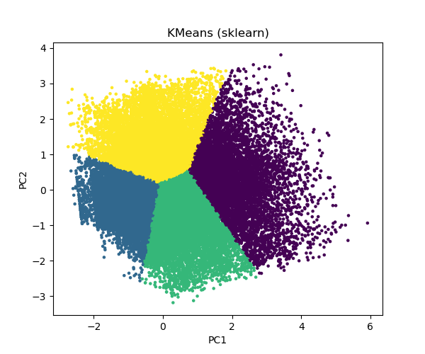
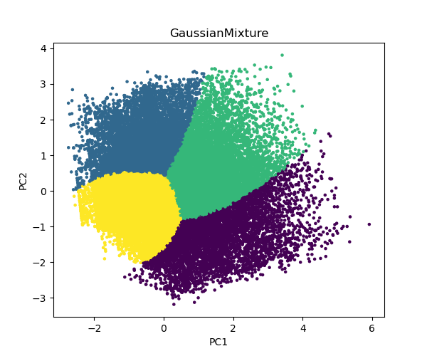
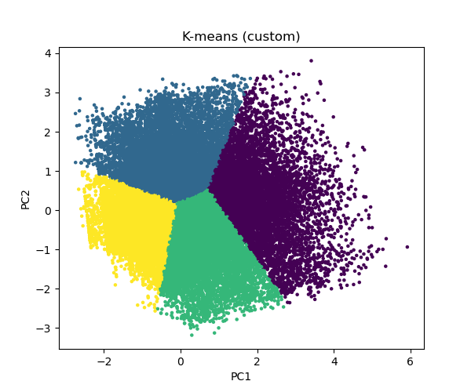
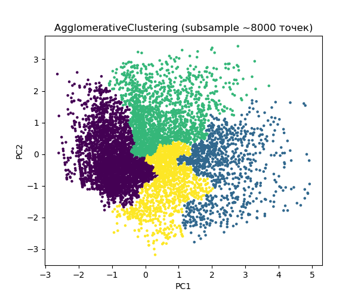

# 🏙️ Лабораторная работа 4: Кластеризация данных Airbnb (NYC 2019)

<!-- Иконки технологий для README -->
[](https://www.docker.com/)
[](https://www.r-project.org/)
[](https://www.python.org/)
## 📋 Содержание

- [Описание проекта](#-описание-проекта)
- [Цели и задачи](#-цели-и-задачи)
- [Используемые технологии](#-используемые-технологии)
- [Установка и запуск](#-установка-и-запуск)
- [Структура проекта](#-структура-проекта)
- [Ход работы](#-ход-работы)
- [Результаты и Интерпретация](#-результаты-и-интерпретация)
- [Выводы](#-выводы)
- [Автор](#-автор)

-----

## 📄 Описание проекта

Данный проект посвящен анализу и кластеризации датасета **Airbnb Нью-Йорка за 2019 год**. Основная цель работы — выявление скрытых групп (кластеров) объявлений с похожими характеристиками, такими как цена, доступность, активность отзывов и тип жилья.

В ходе работы реализован полный цикл анализа данных (Data Science Pipeline): от предварительной очистки и EDA (Exploratory Data Analysis) на языке **R** до применения алгоритмов машинного обучения на **Python**.

## 🎯 Цели и задачи

1.  **Анализ данных:** Изучение структуры датасета, выявление пропусков и аномалий.
2.  **Препроцессинг:** Очистка данных, обработка выбросов (IQR), нормализация.
3.  **Визуализация:** Построение графиков для понимания распределения признаков.
4. **Кластеризация:** Реализация и сравнение алгоритмов:
      * K-means (собственная реализация и `scikit-learn`)
      * Агломеративная кластеризация
      * Gaussian Mixture Models (GMM)
5.  **Оценка качества:** Использование метрики силуэта (Silhouette Score).

-----

## 🛠️ Используемые технологии

Проект построен с использованием гибридного подхода (R + Python) и контейнеризации.

| Категория | Инструменты |
|-----------|-------------|
| **Языки** | **R** (препроцессинг), **Python** (ML/Кластеризация) |
| **Библиотеки R** | `tidyverse` (манипуляция), `lubridate` (даты), `ggplot2` (графики) |
| **Библиотеки Python** | `pandas`, `numpy`, `scikit-learn`, `matplotlib`, `seaborn` |
| **Инфраструктура** | Docker, Docker Compose |
| **Среды** | Jupyter Notebook, RStudio |

-----

## 🚀 Установка и запуск

Проект полностью контейнеризирован. Для запуска вам потребуются **Docker** и **Docker Compose**.

### 1\. Клонирование репозитория

```bash
git clone https://github.com/Delalore2005/Lab_4.git
cd Lab_4
```

### 2\. Запуск контейнеров

Поднимите окружение одной командой:

```bash
docker-compose up -d
```

### 3\. Доступ к интерфейсам

После успешного запуска вам будут доступны следующие сервисы:

  * 📒 **Jupyter Notebook:** [http://localhost:8888](http://localhost:8888)
      * **Токен:** `470177`
  * 📊 **RStudio:** [http://localhost:8787](http://localhost:8787)
      * **Логин:** `rstudio` (стандартный)
      * **Пароль:** `470177`

-----

## 📂 Структура проекта

```text
Lab_4/
├── data/                  # Данные
│   └── airbnb_clean.csv   # Очищенный датасет (результат работы R)
├── images/                # Сохраненные графики и визуализации
├── py_scripts/            # Python: Кластеризация и моделирование
│   └── airbnb_clustering.py.ipynb
├── r_scripts/             # R: Очистка и разведочный анализ
│   └── cleaning_airbnb.ipynb
├── docker-compose.yml     # Конфигурация сервисов
└── README.md              # Документация
```

-----

## 📊 Ход работы

### 1\. Предварительная обработка (R)

*Файл: `r_scripts/cleaning_airbnb.ipynb`*

Исходный датасет содержал **48,895** записей. Были выполнены следующие шаги:

  * **Очистка:** Удалено 102 дубликата и неинформативные столбцы (`id`, `name`, `host_name`).
  * **Работа с пропусками:** `NA` в отзывах заменены на 0.
  * **Фильтрация:**
      * Цена: $0 < Price \le 500$
      * Минимум ночей: $\le 365$
  * **Удаление выбросов:** Использован метод межквартильного размаха (IQR).

 🔻 **Итог:** Чистый датасет из **35,841** записей.

### 2\. Кластеризация (Python)

*Файл: `py_scripts/airbnb_clustering.py.ipynb`*

Для кластеризации использовались признаки: `price`, `minimum_nights`, `number_of_reviews`, `reviews_per_month`, `calculated_host_listings_count`, `availability_365`. Данные были масштабированы с помощью `StandardScaler`.

#### Сравнение алгоритмов (Silhouette Score)

| Алгоритм | Silhouette Score | Комментарий |
|----------|:----------------:|-------------|
| **Gaussian Mixture (GMM)** | **0.3795** | Лучший результат |
| K-Means (Custom & Sklearn) | 0.3513 | Стабильный результат |
| Agglomerative Clustering | 0.3018 | Наименьшее качество разделения |

**Доля объяснённой дисперсии PCA:** 0.2579 (1-я компонента), 0.1802 (2-я компонента) - суммарно 43.81%

#### Собственная реализация K-Means

В учебных целях была написана собственная функция кластеризации:

```python
def kmeans_custom(X, n_clusters, max_iter=100):
    # Инициализация центроидов и итеративное обновление
    # ... (см. исходный код в ноутбуке)
    return labels, centroids
```

-----

## 📈 Результаты и Интерпретация

Мы выделили 4 устойчивых кластера. Ниже приведена их интерпретация на основе средних значений признаков:

| Кластер | Тип | Описание |
|:---:|:---|:---|
| **0** | ⭐ **Популярный "Средний класс"** | Цена ~$112.94. Много отзывов (25.09), высокая доступность (201.07 дней/год). Оптимальный выбор для туристов. |
| **1** | 🏠 **Редкий / Долгосрочный** | Цена ~$93.34. Мало отзывов (2.83), почти недоступны (27.98 дней/год). Вероятно, жилье сдается редко или на долгий срок. |
| **2** | 💰 **Бюджетный сегмент** | Цена ~$77.43. Умеренное кол-во отзывов (9.49), доступность средняя (137.88 дней/год). Самый дешевый вариант. |
| **3** | 💎 **Премиум** | Цена ~$202.76. Самое дорогое жилье. Отзывов меньше, чем в среднем классе (6.73), но цена значительно выше. |

### Визуализация кластеров (PCA Projection)

*(Примеры визуализаций из папки `images/`)*

| K-Means (Sklearn) | Gaussian Mixture |
|:---:|:---:|
|  |  |

| K-Means (Custom) | Agglomerative Clustering |
|:---:|:---:|
|  |  |

-----

## ✅ Выводы

1.  **Качество данных:** агрессивная очистка и работа с выбросами позволили выделить четкие структуры в данных.
2.  **Выбор алгоритма:** GMM показал наилучшее разделение, так как он учитывает не только расстояние (как K-means), но и форму распределения (дисперсию) кластеров.
3.  **Бизнес-инсайт:** рынок четко сегментирован по цене и доступности. "Активные" объявления (кластер 0) составляют значительную долю рынка и характеризуются средней ценой, а не низкой, что говорит о важности баланса цены и отзывов.

-----

## 👤 Автор

**Delalore2005**

  * GitHub: [Delalore2005](https://github.com/Delalore2005)

*Проект выполнен в рамках лабораторной работы по дисциплине "БДИАН".*
