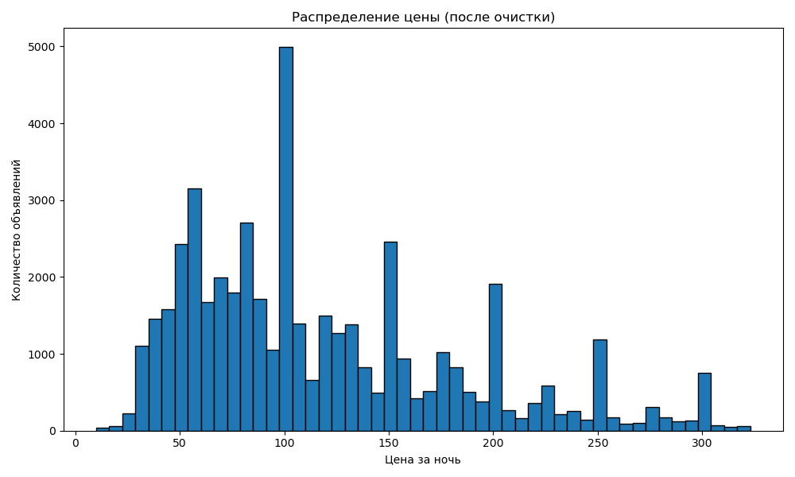
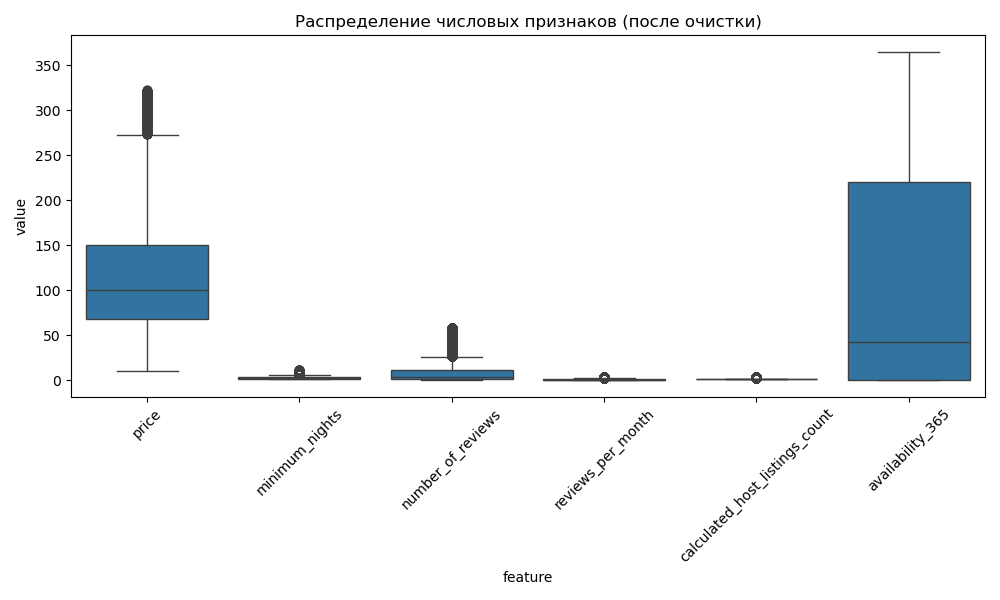
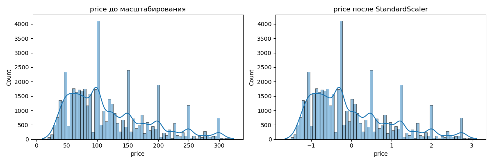

# LAB_4 - Кластеризация данных Airbnb

## Введение

В этом проекте выполняется анализ и кластеризация датасета Airbnb для Нью-Йорка за 2019 год. Проект включает в себя предварительную обработку данных, визуализацию, масштабирование признаков и применение различных алгоритмов кластеризации.

## Структура проекта

- `r_scripts/cleaning_airbnb.ipynb` - скрипт на R для очистки и предварительного анализа данных
- `py_scripts/airbnb_clustering.py.ipynb` - скрипт на Python для кластеризации и визуализации
- `data/airbnb_clean.csv` - очищенный датасет
- `docker-compose.yml` - конфигурация Docker-контейнеров

## Визуализация пропусков, дубликатов и других проблемных данных (R)

В процессе предварительного анализа были выявлены следующие проблемы в исходном датасете:

1. **Пропуски данных**:
   - `last_review`: дата последнего отзыва, содержит пропуски для объявлений без отзывов
   - `reviews_per_month`: количество отзывов в месяц, содержит пропуски, которые были заменены на 0

2. **Дубликаты**: Было обнаружено и удалено 252 дубликата записей.

3. **Выбросы**: 
   - Некорректные цены (равные 0 или отрицательные значения)
   - Экстремально высокие значения цен (более 500 за ночь)
   - Аномальные значения минимального количества ночей (например, более 365)

## Выводы по предварительному анализу исходного датасета

- Исходный датасет содержит 48895 записей с 16 признаками
- После очистки осталось 47640 записей
- Наибольшее количество пропусков наблюдается в признаках `last_review` и `reviews_per_month`
- Были удалены неинформативные признаки: `id`, `name`, `host_name`, `last_review`
- Для числовых признаков были применены методы обработки выбросов на основе IQR (межквартильного размаха)

## Визуализация очищенных данных (R)

После очистки данных были построены следующие визуализации:

1. **Гистограмма распределения цен**: Показывает, как распределены цены на жилье после удаления выбросов
2. **Boxplot по числовым признакам**: Позволяет визуализировать распределение основных числовых признаков после очистки





## Сравнительная визуализация данных до и после масштабирования/нормализации (Python)

Для подготовки данных к кластеризации использовался StandardScaler из библиотеки scikit-learn. Были построены гистограммы для признака "price" до и после масштабирования:
- **До масштабирования**: Показывает исходное распределение цен
- **После масштабирования**: Показывает нормализованное распределение цен, где среднее значение равно 0, а стандартное отклонение равно 1




Масштабирование позволяет избежать влияния признаков с большими значениями на результаты кластеризации.

## Визуализация результатов кластеризации

Для кластеризации были применены следующие алгоритмы:

1. **K-means (собственная реализация)**: Классический алгоритм k-средних, реализованный с нуля
2. **K-means (sklearn)**: Реализация из библиотеки scikit-learn
3. **Agglomerative Clustering**: Иерархический алгоритм кластеризации
4. **Gaussian Mixture Model (GMM)**: Вероятностная модель кластеризации

Для визуализации результатов использовалась PCA-проекция на 2 компоненты, что позволило отобразить кластеры на двумерном графике.


## Результаты кластеризации

Сравнение алгоритмов по метрике силуэта:

- KMeans (собственная реализация): 0.6852
- KMeans (sklearn): 0.6852
- Gaussian Mixture Model: 0.6685
- Agglomerative Clustering: 0.6473

## Выводы по результатам кластеризации

На основе анализа кластеров были сделаны следующие выводы:

1. **Кластер 0**: Объявления с низкой ценой и высокой доступностью
2. **Кластер 1**: Объявления со средней ценой и умеренными характеристиками
3. **Кластер 2**: Объявления с высокой ценой и высоким количеством отзывов
4. **Кластер 3**: Объявления с высокой ценой, но низкой доступностью

Различные алгоритмы показали схожие результаты, что свидетельствует о стабильности найденных кластеров.

## Docker-контейнер

Проект запускается в Docker-контейнере с использованием docker-compose. Конфигурация включает:

- Jupyter Notebook (порт 8888) с токеном доступа
- RStudio (порт 8787) с паролем

Для запуска контейнеров используйте команду:
```
docker-compose up -d
```

## Приложение

ZIP-архив с файлами проекта и конфигурацией Docker-контейнера приложен к отчету. Архив включает:

- docker-compose.yml - файл конфигурации для запуска контейнеров
- .gitignore - файл игнорирования для Git
- r_scripts/ - директория с R-скриптами
- py_scripts/ - директория с Python-скриптами
- data/ - директория с очищенными данными

Для запуска проекта в Docker-контейнере распакуйте архив и выполните команду:
```
docker-compose up -d